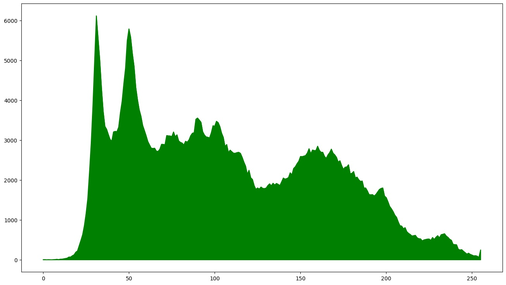

# Homework #6

### 1. Размытие картинки и "Median filter" [25 баллов]
Фильтр по шаблону. В каждом пикселе картинки надо усреднить по шаблону с коэффициентами в окрестности данного пикселя. Например, для шаблона 5x5:
```
for(int k=-2;k<=2; k++)
{
    for(int l=-2; l<=2; l++)
    {
        u[i][j]+=1/s*a[k][l]*u[i+k][j+l];
    }
}
// s = сумма всех коэффициентов шаблона (25 значений для 5x5)
```
Продемонстрируйте результат размытия для 2 разных шаблонов.

[main.py](blur/main.py)
```shell
python main.py gaussian -i image_path -o output_name --size=kernel_size
```

Origin             |  Kernel size 3
:-------------------------:|:-------------------------:
  |  
Kernel size 5             |  Kernel size 9
  |  


### 2. Медианный фильтр [25 баллов]
Имплементируйте [Median filter](https://en.wikipedia.org/wiki/Median_filter)

### 3. Гистограмма картинки [50 баллов]
Загрузите или создайте картинку (если она цветная можете 
конвертировать в grayscale или сделать гистограмму для каждого канала), 
сделайте гистограмму по яркости

[main.py](histogram/main.py)
```shell
python main.py histogram -i images/test_image.jpeg -o result
```

Origin


Color | Channel             |  Histogram
:-------------------------:|:-------------------------:|:-------------------------:
Red |   |  
Green |   |  
Blue |   |  
